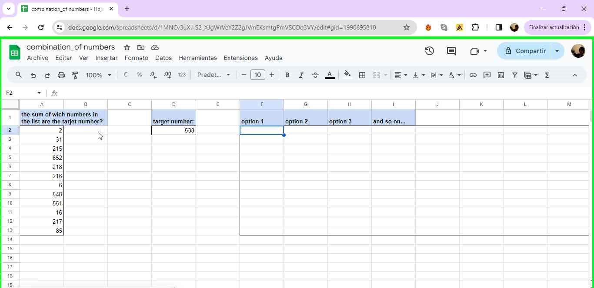
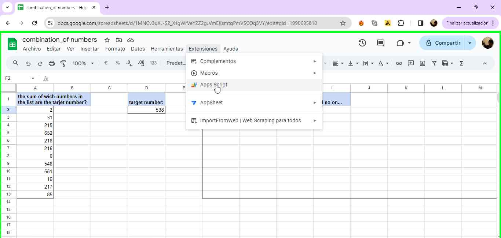

# Tutorial: Finding Number Combinations in Spreadsheets

In this script, we'll learn how to use a custom function in Google Sheets to find number combinations that sum up to a target value. This can be handy when you're working with a list of numbers and need to identify which combinations result in a specific value.

## Introduction to the Script

Imagine you're working in a Google spreadsheet and you have a column with a list of numbers. You know that the sum of some of these numbers in the column equals a specific number you're looking for, which we'll call **the target number**. For example, in the following image, our target number is 538:



So, what we're trying to do is find combinations of numbers in the column that sum up to the target number. In other words:


#### x+y+z+....=336


But checking all possible combinations can take a lot of time and effort.

## Using Google Apps Script

There's a more efficient way to do this using a custom function in Google Sheets. Here's how:

1. Go to **Extensions** in the menu bar.
2. Select **Apps Script**.



#### Now, let's create your own custom function.


```javascript
/**
 * @customfunction
 */
function SEARCH_COMBINATION(cellRange, targetCell, marginOfError, positiveAndNegativeValues) {
  var sheet = SpreadsheetApp.getActiveSpreadsheet().getActiveSheet();

  try {
    // Get cell values only once
    var data = sheet.getRange(cellRange).getValues().flat();

    // Filter values based on the positiveAndNegativeValues parameter
    data = data.filter(function(value) {
      if (positiveAndNegativeValues) {
        return value !== null;
      } else {
        return value !== null && value !== 0;
      }
    });

    // Filter values based on the relationship with the target
    if (!positiveAndNegativeValues) {
      var targetValue = sheet.getRange(targetCell).getValue();
      data = data.filter(function(value) {
        return (targetValue > 0 && value <= targetValue) || (targetValue < 0 && value >= targetValue);
      });
    }

    // Get the value of the target cell
    var targetCellValue = sheet.getRange(targetCell).getValue();

    // Convert values to numbers and sort the range (optional)
    var numericData = data.map(function(cell) {
      return parseFloat(cell);
    }).sort(function(a, b) {
      return a - b;
    });

    // Call the recursiveSearch function with the data, target value, margin of error, and positiveAndNegativeValues parameter
    var foundCombinations = recursiveSearch(numericData, targetCellValue, 0, 0, [], marginOfError, positiveAndNegativeValues);

    // Return the information in transposed form
    if (foundCombinations.length > 0) {
      return transposeMatrix(foundCombinations);
    } else {
      return "No combinations found";
    }
  } catch (error) {
    console.error(error);
    return "Error: " + error.message;
  }
}

/**
 * Function to recursively search for combinations.
 */
function recursiveSearch(data, target, accumulated, index, currentCombination, marginOfError, positiveAndNegativeValues) {
  currentCombination = currentCombination || [];
  marginOfError = marginOfError || 0;
  positiveAndNegativeValues = positiveAndNegativeValues || false;

  function isValidValue(value) {
    if (positiveAndNegativeValues) {
      return value !== null;
    } else {
      return value !== null && value !== 0;
    }
  }

  if (Math.abs(accumulated - target) <= marginOfError && currentCombination.length > 0) {
    return [currentCombination];
  }

  if (index >= data.length) {
    return [];
  }

  // Filter values based on positiveAndNegativeValues parameter and relationship with the target
  var currentValue = data[index];
  if (positiveAndNegativeValues) {
    var include = isValidValue(currentValue) ?
      recursiveSearch(data, target, accumulated + currentValue, index + 1, [...currentCombination, currentValue], marginOfError, positiveAndNegativeValues) :
      [];
  } else {
    var condition = (target > 0 && currentValue <= target) || (target < 0 && currentValue >= target);
    var include = condition && isValidValue(currentValue) ?
      recursiveSearch(data, target, accumulated + currentValue, index + 1, [...currentCombination, currentValue], marginOfError, positiveAndNegativeValues) :
      [];
  }

  // Do not include the current element in the combination
  var exclude = recursiveSearch(data, target, accumulated, index + 1, currentCombination, marginOfError, positiveAndNegativeValues);

  // Combine the results
  return include.concat(exclude);
}

/**
 * Function to transpose a matrix.
 */
function transposeMatrix(matrix) {
  return matrix[0].map(function(_, i) {
    return matrix.map(function(row) {
      return row[i];
    });
  });
}
```
#### You can copy and paste this content directly into your **Apps Script** and safe it!


#### Ones we finish refresh the web page (just in case) so the new funtion start working.


so you can use the next funtion

The funtion is

## =SEARCH_COMBINATION(cellRange; targetCell; marginOfError; positiveAndNegativeValues) 


#### **cellRange:** is the range of cells were the funtion need to look for 

 - it will pass all the numbers that are higher from the **target number** or null or 0.
 - try not to use more than 20 cells if not it can colapse. 


#### **targetCell:** here you put the number you are looking for


### ***Important!!*** the cells you call for the funtion they need " " like the image above.


- If the funtion colapse it can be because the the target number is represent almoust all the *cellRange* numbers. you can try the other way round. 
In other cell sum. 
 * =sum(all the cells in *cellrange*)-*cellRange*

 
 
 * this will be the oposite *targetCell*, try to use like *targetCell* an the combination that wive you are the numbers that are not part of the sum

 #### **marginOfError:** here you put whats your margin error from the target 
 * Example: if you use 2 it will accept *targetCell* value + or 
 -2
  


 #### **positiveAndNegativeValues** it only accept booling values (true/false) 
 - if you are looking por negative values then *TRUE* of not *FALSE*
 
 -Leave it in false if you dont have negative number for better performance.

I hope is usefull!! pleas leave in comments if you had problems
